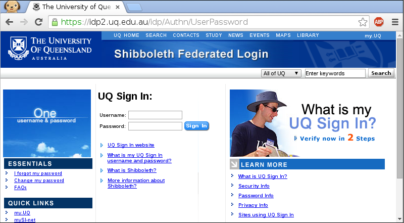
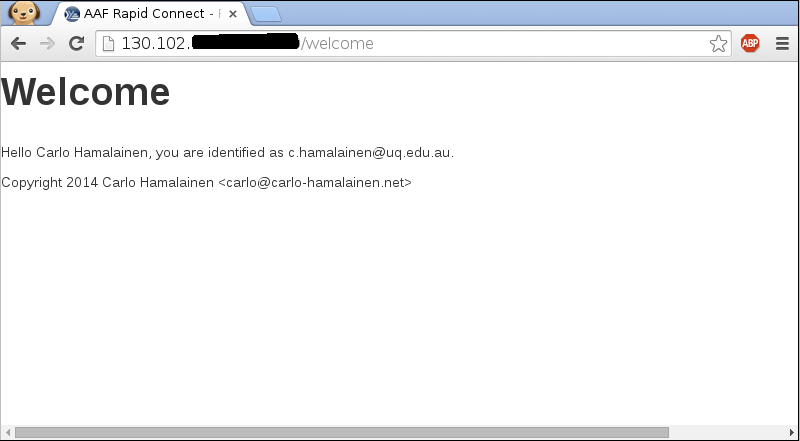

# Rapid Connect Yesod Demo

An example Yesod site that uses AAF's [Rapid Connect](https://rapid.aaf.edu.au/) for authorisation.

## How does it work?

There is a lot of code in this repo due to the scaffolding that
you get with a Yesod 1.2 site, but only two files are of real
importance for the purpose of this demo. First, JWT decoding and
verification happens in [AuthJwt.hs](./Handler/AuthJwt.hs). Secondly,
[Welcome.hs](./Handler/Welcome.hs) checks two session variables
to ensure that the user has successfully authenticated.

## Configuration

In ```Handler/AuthJwt.hs``` and edit these values:

* ```configIss```: the issuer, typically ```https://rapid.test.aaf.edu.au``` in the test federation
or ```https://rapid.aaf.edu.au``` in the production federation.
* ```configAudience```: the url for your application that you provided when you
registered your Rapid Connect service.
* ```secret```: the secret that you generated and used during the registration process.

In ```Handler/Home.hs``` edit ```rapidConnectAuthURL```, the URL that the Rapid Connect service generated specifically for your site's authorisation process. It probably looks like
```https://rapid.test.aaf.edu.au/jwt/authnrequest/research/XXXX``` for the test federation and ```https://rapid.aaf.edu.au/jwt/authnrequest/research/XXXX``` for the production federation.

In ```config/settings.yml``` edit value of ```approot``` to be the base URL for the site.

## Building

Building in a sandbox is strongly recommended. Use the provided script:

    ./build_in_sandbox.sh

## Testing

Start the server:

    .cabal-sandbox/bin/rapidconnect-sample-haskell-yesod Development

Visit the url that you set ```approot``` to in ```settings.yml```. You should see the home page:


Click the login link, and after choosing your institution, you will be presented with your institution's single sign on page:



After that, you will be redirected to the welcome page of this Yesod site:



